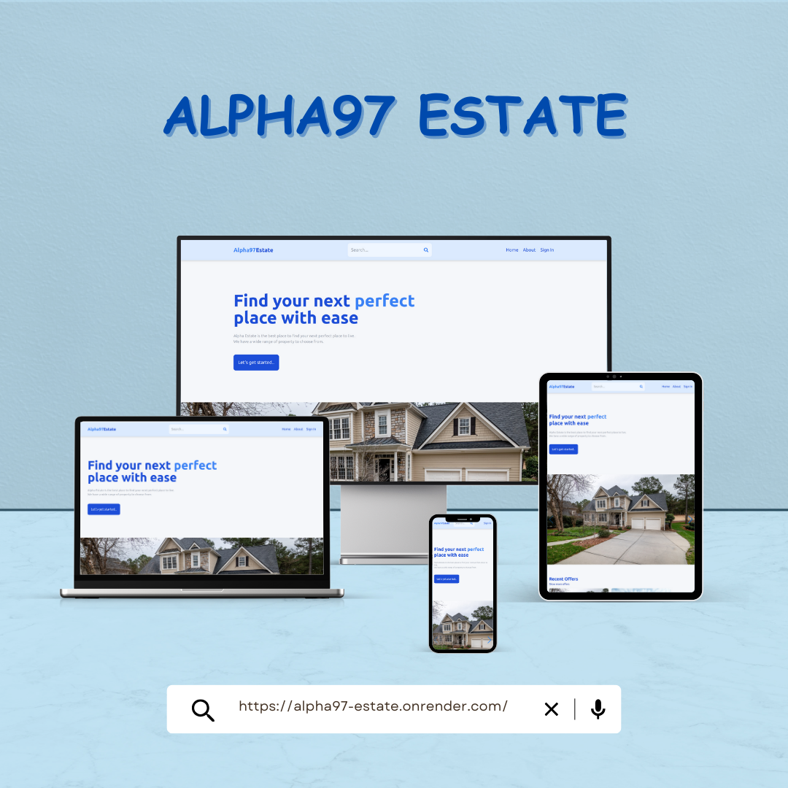

# Alpha97 Estate - Real Estate Web App



Alpha97 Estate is a modern real estate web application built with the MERN (MongoDB, Express.js, React, Node.js) stack. It provides a platform for users to search, list, and explore various properties, whether for sale or rent. The application offers a user-friendly interface, advanced search options, and a seamless user experience.

Check out the live app: [Alpha97 Estate on Render](https://alpha97-estate.onrender.com/)

## Features

- **Property Listings**: View a wide range of property listings with detailed information, including descriptions, prices, addresses, and more.

- **Advanced Search**: Customize your property search by type (rent/sale), amenities, sorting options, and more.

- **User Profiles**: Registered users can create and manage their profiles with profile pictures and listings also.

- **Authentication**: Secure user registration and login functionality with Google OAuth.

## Screenshot


## Installation

1. Clone the repository:

   ```bash
   git clone https://github.com/alphadev97/AlphaEstate.git
   ```

2. Change into the project directory:
   ```bash
   cd AlphaEstate
   ```
3. Install server dependencies:

   ```bash
   npm install
   ```

4. Install client dependencies:

   ```bash
   cd client
   npm install
   ```

5. Create a .env file in the root directory with your configuration settings.

   ```bash
   MONGO = "MONGODB URI"
   JWT_SECRET = "JWTSECRET"
   ```

6. Create a .env file in the ./client directory with your configuration settings.

   ```bash
   VITE_FIREBASE_API_KEY = "ADD YOUR FIREBASE KEY"
   ```

7. Start the development server:

   ```bash
   npm run dev
   ```

## Usage

- Access the web app via the provided link: [Alpha97 Estate on Render](https://alpha97-estate.onrender.com/)

- Explore property listings, customize your search, and create a user profile to list properties or access additional features.

## Contributing

Contributions are welcome! Please follow these steps to contribute to the project:

1. Fork the repository.
2. Create a new branch for your feature or bug fix:

   ```bash
   git checkout -b feature/your-feature-name
   ```

3. Make your changes and commit them:

   ```bash
   git commit -m "Your commit message here"
   ```

4. Push your changes to your fork:

   ```bash
   git push origin feature/your-feature-name
   ```

5. Create a pull request to the main repository.

## License

This project is licensed under the MIT License. See the [LICENSE](./LICENSE) file for details.

## Contact

1. [GITHUB](https://github.com/alphadev97)
2. [LINKEDIN](https://www.linkedin.com/in/alpha97/)
